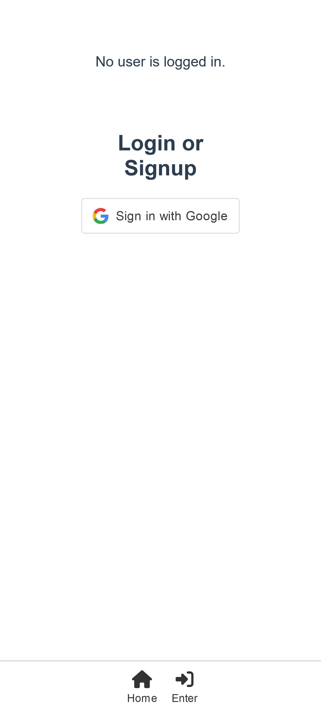
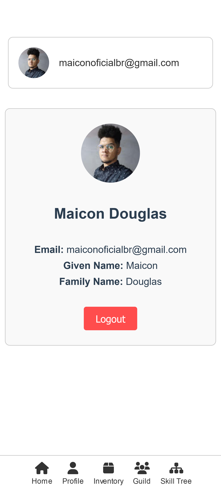
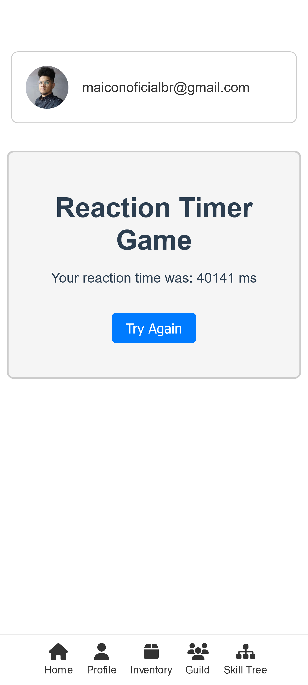
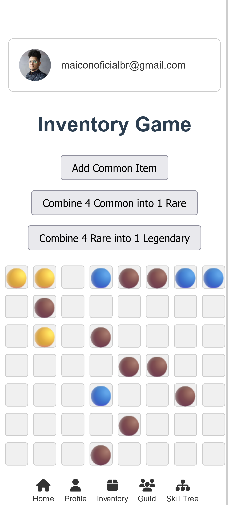
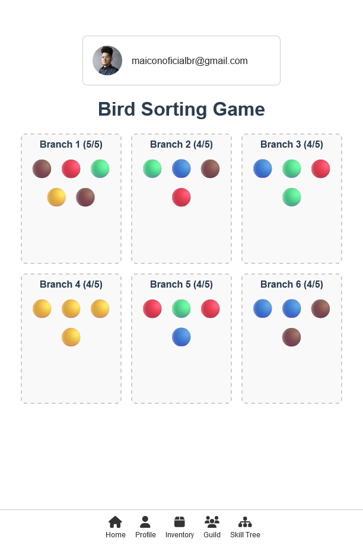

# Learning Vue JS
Hi, I'm just learning Vue.js and having some fun.

# Google Auth
Well, I was curious about how simple it is to authenticate with Google and here it is:

| Enter (login) view | Profile view |
| ------------ | ------------------ |
|  |  |

With a few lines of code I just made an Google Authentication. Well, I'm not storing the google token in the most secure way but it is just fine as I wont create an entire backend just for learning Vue.js 😅.

# Minigames
The project comes with some minigames I made for fun with ChatGPT o3 help. Have fun testing!

| Timer game | Inventory game |
| ---------- | -------------- |
|  |  |

## Bird Sorting Game
This one is special, I'm also storing the content into cookies so the progress is saved.


## Project setup
```
npm install
```

### Compiles and hot-reloads for development
```
npm run serve
```

### Customize configuration
See [Configuration Reference](https://cli.vuejs.org/config/).
